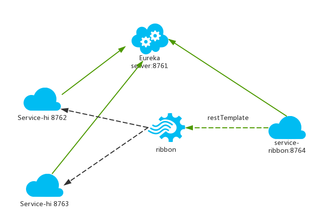

在上一篇文章，讲了服务的注册和发现。在服务架构中，业务都会被拆分成一个独立的服务，服务与服务的通讯是基于 http restful 的。spring cloud 有两种调用方式，一种是 ribbon+restTemplate，另一种是 feign。在这一篇文章首先讲解下基于 ribbon+rest。

## ribbon
 * 是一个负载均衡客户端，可以很好的控制 http 和 tcp 的一些行为。Feign 也用到 ribbon，当你使用 @ FeignClient，ribbon 自动被应用。
   
 * ribbon 已经默认实现了这些配置 bean：

    * IClientConfig ribbonClientConfig: DefaultClientConfigImpl

    * IRule ribbonRule: ZoneAvoidanceRule

    * IPing ribbonPing: NoOpPing

    * ServerList ribbonServerList: ConfigurationBasedServerList

    * ServerListFilter ribbonServerListFilter: ZonePreferenceServerListFilter

    * ILoadBalancer ribbonLoadBalancer: ZoneAwareLoadBalancer
    
### 准备工作
    
   * 基于上一节的工程，启动 eureka-server 工程；启动 service-hi 工程，它的端口为 8762；将 service-hi 的配置文件的端口改为 8763, 并启动它，这时你会发现：service-hi 在 eureka-server 注册了 2 个，这就相当于一个小的集群。访问 localhost:8761 如图所示：
   
   
   
   
## 新建一个service-ribbon
   
   * spring-cloud-starter-eureka
   * spring-cloud-starter-ribbon
   * spring-boot-starter-web
   * spring-boot-starter-test
   
### 想eureka注册一个客户端
    eureka:
       client:
         serviceUrl:
           defaultZone: http://localhost:8761/eureka/
     server:
       port: 8764
     spring:
       application:
         name: service-ribbon  
         
### 启动类
   * 在工程的启动类中, 通过 @EnableDiscoveryClient 向服务中心注册；   
   
### 架构如下
         