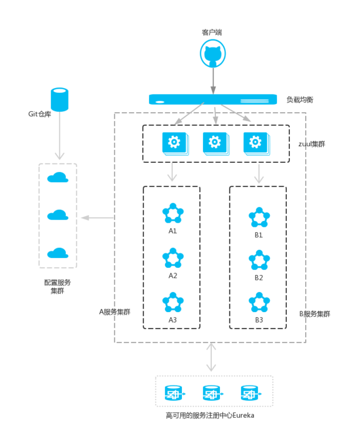

在微服务架构中，需要几个关键的组件，服务注册与发现、服务消费、负载均衡、断路器、智能路由、配置管理等，由这几个组件可以组建一个简单的微服务架构，如下图：

注意：A 服务和 B 服务是可以相互调用的，作图的时候忘记了。并且配置服务也是注册到服务注册中心的。

客户端的请求首先经过负载均衡（zuul、Ngnix），再到达服务网关（zuul 集群），然后再到具体的服务，服务统一注册到高可用的服务注册中心集群，服务的所有的配置文件由配置服务管理（下一篇文章讲述），配置服务的配置文件放在 Git 仓库，方便开发人员随时改配置。

一、Zuul 简介

Zuul 的主要功能是路由和过滤器。路由功能是微服务的一部分，比如／api/user 映射到 user 服务，/api/shop 映射到 shop 服务。zuul 实现了负载均衡。

zuul 有以下功能：

Authentication
Insights
Stress Testing
Canary Testing
Dynamic Routing
Service Migration
Load Shedding
Security
Static Response handling
Active/Active traffic management

二、准备工作

继续使用上一节的工程。在原有的工程上，创建一个新的工程。

三、创建 service-zuul 工程

     <dependency>
            <groupId>org.springframework.cloud</groupId>
            <artifactId>spring-cloud-starter-eureka</artifactId>
        </dependency>
        <dependency>
            <groupId>org.springframework.cloud</groupId>
            <artifactId>spring-cloud-starter-zuul</artifactId>
        </dependency>
        <dependency>
            <groupId>org.springframework.boot</groupId>
            <artifactId>spring-boot-starter-web</artifactId>
        </dependency>

        <dependency>
            <groupId>org.springframework.boot</groupId>
            <artifactId>spring-boot-starter-test</artifactId>
            <scope>test</scope>
        </dependency>
        
在其入口 applicaton 类加上注解 @EnableZuulProxy，开启 zuul：

filterType：返回一个字符串代表过滤器的类型，在 zuul 中定义了四种不同生命周期的过滤器类型，具体如下： 
pre：路由之前
routing：路由之时
post： 路由之后
error：发送错误调用
filterOrder：过滤的顺序
shouldFilter：这里可以写逻辑判断，是否要过滤，本文 true, 永远过滤。
run：过滤器的具体逻辑。可用很复杂，包括查 sql，nosql 去判断该请求到底有没有权限访问。        